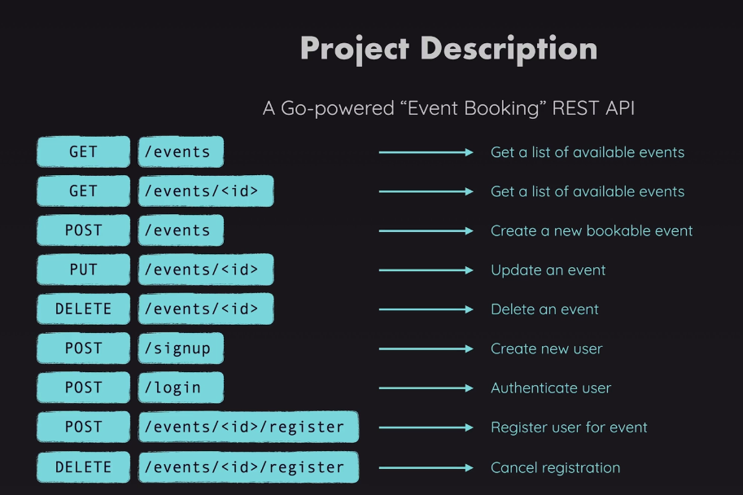

 # Go REST API

 # Plan For API

 

## What is a REST API?

A REST API (Representational State Transfer Application Programming Interface) is a way for applications to communicate over HTTP. It exposes resources—such as users, products, or posts—through predictable URLs and uses standard HTTP methods to perform actions:

- `GET` retrieves a resource.
- `POST` creates a resource.
- `PUT` or `PATCH` updates a resource.
- `DELETE` removes a resource.

REST APIs are typically stateless, meaning each request contains all the information needed to process it. Responses are commonly formatted as JSON, making them easy for different applications and programming languages to consume.
